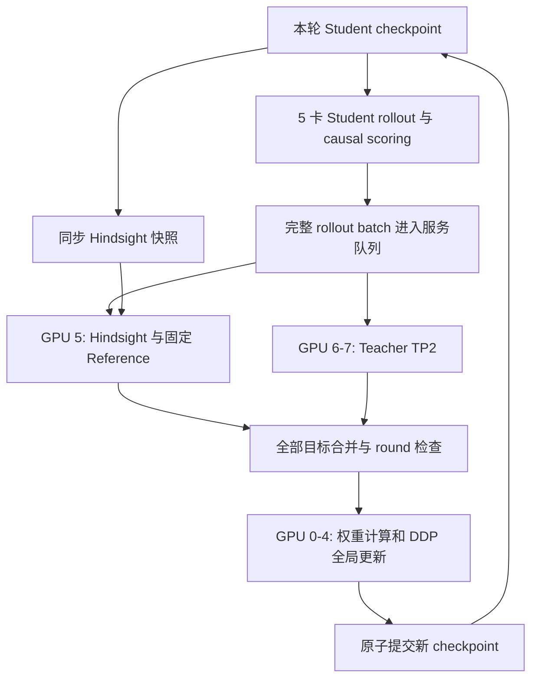

# LuLu：Trajectory-balanced Bounded Absolute ReN

本文说明**已经实现并完成实验的 `ren_balanced` 算法**，以 `ren_balanced_matched_b256_c0p5_8k_r4_s42_20260918` 为具体训练配方。内容对照实际代码、冻结配置和运行记录整理，更新日期为 2026-09-18。

> Use privileged self-distillation to estimate which external-Teacher supervision is compatible with the Student, while prioritizing corrections that differ from the Student’s current behavior.

具体而言：Student 在自己的 on-policy 推理前缀上，比较“普通视角”和“知道正确最终答案的视角”对 external Teacher 分布的拟合程度。答案条件能够解释的 Teacher–Student 差异越大，该位置的 Teacher distillation 权重越大；再用按题等权的 reasoning objective 更新 Student。

当前版本是 **state-level 标量加权完整 Teacher KL**。Hindsight 提供权重，不直接作为训练 target；没有裁剪 Teacher 的 action-level correction，也没有把 Teacher 与 causal Student 混成新的 target。

| 本轮核心项 | 实际配置 |
|---|---|
| Student | Qwen3-1.7B，thinking，全参数训练 |
| External Teacher | Qwen3-32B，固定参数、answer-blind、同轨迹 teacher forcing |
| Hindsight Student | 同轮 Student 快照，额外看到正确最终答案 |
| Reference | 本次训练的初始 Student，始终冻结 |
| 数据 | 固定 DAPO-Math-17k 的 2048 题训练池 |
| 数据曝光 | 每轮 256 个新题 × 4 轮，共 1024 个不同题目 |
| 采样 | 每题 1 条，最多 8192 response tokens，T=0.6 / top-p=0.95 / top-k=20 |
| 更新 | 每轮累计整个 batch 后更新一次，共 4 个 optimizer steps |
| Objective | `L_R + 0.5 L_C + 0.1 L_ref` |
| 评估 | Fresh Base / Round2 / Round4；32k 实际生成，同时重评其 8k 前缀 |

**入口与证据：**

- [本轮冻结配置](../LuLu_outputs/experiments/ren_balanced_matched_b256_c0p5_8k_r4_s42_20260918/experiment_plan.json)
- [本轮完成状态](../LuLu_outputs/experiments/ren_balanced_matched_b256_c0p5_8k_r4_s42_20260918/live_progress.json)
- [结果汇总](../LuLu_outputs/experiments/ren_balanced_matched_b256_c0p5_8k_r4_s42_20260918/REPORT.md)与[训练、评估详细分析](../LuLu_outputs/experiments/ren_balanced_matched_b256_c0p5_8k_r4_s42_20260918/analysis_postrun/INTERPRETATION.md)
- [历史 8k 实验完整节点](md/historical_balanced_8k.md)：Base / Round8 / Final12，以及 dev Round0/4/8/12
- [历史 README](md/README_before_recipe_20260918.md)：保留先前方法和实验背景，不能用其中的旧配置代替本文当前配方

## 1. 目录、代码与实验快照

工作区布局如下，`Lulu` 与 `Soraka` 并排：

```text
Rona_Soraka/
├── Lulu/                         # 可编辑源代码；注意实际目录的大小写
│   ├── README.md
│   ├── pyproject.toml
│   ├── lulu/                     # 核心 Python 包
│   ├── scripts/                  # 数据准备、训练、评估、实验控制器
│   ├── tests/
│   └── md/                       # 历史说明
├── LuLu_outputs/                 # 数据、模型、实验与分析产物
├── Soraka/
└── Soraka_rlrl/
```

训练/评估核心包不需要导入 Soraka 训练代码；当前工作区的实验 manifest 会引用已有 Soraka benchmark 数据文件。这是数据路径复用，不是算法实现耦合。

本轮实际执行的是实验目录下冻结的源码副本：

```text
LuLu_outputs/experiments/
  ren_balanced_matched_b256_c0p5_8k_r4_s42_20260918/
    code/scripts/train_lulu.py
    code/scripts/evaluate_lulu.py
    code/lulu/...
```

因此，`Lulu/` 是后续开发入口，实验目录的 `code/`、`experiment_plan.json`、输入和源码 hash 才是本轮复现依据。本文更新不会改变已完成实验的代码快照或结果。

## 2. 模型、符号与三个同前缀分布

令：

- 第 `r` 轮开始时 Student 参数为 `θ_r`，对应快照 `S_r`。
- 固定 Teacher 为 `T`，固定初始 reference 为 `S_0`。
- `x_i` 是题目，`a_i*` 是该题正确最终答案。
- `y_ij` 是本轮 Student 对题目 `i` 的第 `j` 条实际采样轨迹。
- `y_ij,<t` 是这条轨迹在位置 `t` 之前的 token 前缀。
- `p_θ` 是正在更新的 Student；本轮第一次 backward 前 `θ=θ_r`。

在**同一条 Student 轨迹、同一预测位置**上计算：

| 分布 | 定义 | 是否见正确答案 | 参数是否更新 |
|---|---|---:|---|
| `p_C` | `S_r(· | x_i, y_ij,<t)` | 否 | 打分时冻结；来自本轮 Student |
| `p_H` | `S_r(· | x_i, a_i*, y_ij,<t)` | 是 | 冻结；与 `p_C` 同轮、同参数 |
| `q_T` | `T(· | x_i, y_ij,<t)` | 否 | 全程冻结 |
| `p_ref` | `S_0(· | x_i, y_ij,<t)` | 否 | 全程固定为本次初始 Student |
| `p_θ` | `S_θ(· | x_i, y_ij,<t)` | 否 | 唯一接收梯度的分布 |

前三个分布是 ReN score 的核心。`p_ref` 只负责稳定项，不参与 `g` 和 `w` 的定义。`p_C` 每轮刷新，`p_ref` 不刷新。

Hindsight 不生成另一条“知道答案的推理”；Teacher 也不重新生成正确 solution。它们都 teacher-force 已有 Student 的 `response_ids`，只评估该实际前缀下的下一 token 分布。正确和错误、完成和 capped 的轨迹一律保留。

### 2.1 下一 token 的严格对齐

代码将某个 view 的完整 prompt token IDs 与 Student 的实际 response IDs 拼接。若 prompt 长度为 `L_view`，response 位置使用 0-based `t`，则预测 `response_ids[t]` 的 hidden state 是：

```text
hidden[L_view + t - 1]
```

Causal 与 hindsight prompt 长度不同，分别使用各自 `L_view`；不会使用同一个绝对 hidden index。前缀中没有当前位置的未来 token，也不通过 decode → re-tokenize 替换实际采样的 BPE 分段。

实现见 [selected_hidden](lulu/training.py) 和 [prompt 构造](lulu/data.py)。

## 3. Hindsight prompt 的准确内容

没有单独新增 hindsight system prompt。实现保留输入已有的 system/user messages，在**最后一个 user message 的原题后面追加两个换行及以下文本**：

```text
For this reasoning task, the verified final answer is provided below as additional context. Continue solving the original problem step by step.
<verified_final_answer>
{answer}
</verified_final_answer>
```

即：

```python
hindsight_messages = copy_of(causal_messages)
hindsight_messages[-1]["content"] += "\n\n" + HINDSIGHT_CONTEXT.format(answer=gold_answer)
```

两种 view 均使用 Student tokenizer 的：

```python
tokenizer.apply_chat_template(
    messages,
    tokenize=False,
    add_generation_prompt=True,
    enable_thinking=True,
)
```

本轮继续使用上面的 **Current** prompt，没有换成 Minimal 或 OPSD-style prompt。`a*` 是最终答案，不是 Teacher chain-of-thought，也不是 Student 的预测答案。

Teacher 服务的消息白名单只允许 causal prompt IDs、response IDs、positions 等所需字段；`gold_answer` 和 hindsight prompt 不发送给 Teacher。Reference 也只看 causal view。评估同样只使用原题。

这里的“无答案泄漏”指 privileged 上下文不会进入 causal/Teacher 输入；如果 Student 自己在 sampled prefix 中已经写出了答案，这当然仍属于其实际前缀。

## 4. ReN score：bounded absolute compatibility

所有下式均对**完整模型输出词表**计算，使用自然对数。

\[
D^C_{ijt}=D_{\mathrm{KL}}(q_{T,ijt}\Vert p_{C,ijt}),
\qquad
D^H_{ijt}=D_{\mathrm{KL}}(q_{T,ijt}\Vert p_{H,ijt}).
\]

先计算答案条件解释掉的 Teacher mismatch：

\[
\Delta_{ijt}=D^C_{ijt}-D^H_{ijt}.
\]

取正部并作有界变换：

\[
\boxed{
 g_{ijt}=[\Delta_{ijt}]_+,
 \qquad
 w_{ijt}=\frac{g_{ijt}}{1+g_{ijt}}.
}
\]

数学上 `g≥0`、`0≤w<1`。没有额外的可调 threshold、Top-K support 或 weight mean rescaling。

### 4.1 代码如何计算这个差值

[resolved.py](lulu/resolved.py) 的 `mismatch_scores()` 同时记录两个 KL，但用下式直接计算差值：

\[
\Delta_{ijt}
=\sum_a q_{T,ijt}(a)
   \bigl[\log p_{H,ijt}(a)-\log p_{C,ijt}(a)\bigr].
\]

Teacher entropy 在求和前代数消去，避免先得到两个完整 KL 后再相减所引入的一部分数值抵消。log-softmax、概率与 KL 求和使用 FP32；测试中的 FP64 输入保留 FP64。

[stable.py](lulu/stable.py) 的 `bounded_absolute_weight()` 实现：

```python
gap = resolved_mismatch.detach().clamp_min(0)
weight = gap / (1 + gap)
```

注意：文件中另有 `bounded_weight()`，实现旧的 `clip(g/(D_C+epsilon),0,1)`。`--method ren_balanced` 选择的是 **`bounded_absolute_weight()`**，不是旧 ratio gate。

### 4.2 score 的含义与边界

- `D_H < D_C`：在 Teacher 分布下，知道正确答案后的 Student 给出了更高的平均 log-likelihood，当前位置获得正权重。
- `D_H ≥ D_C`：当前位置的 reasoning Teacher KL 权重为 0；control/reference 仍按各自定义计算。
- 理想数值下，若 `p_H=p_C`，则 `w=0`；若 `q_T=p_C`，则 `D_C=0`，也不会凭空产生正的 compatibility gap。
- `g=0.01` 时 `w≈0.0099`；`g=0.5` 时 `w=1/3`；`g=1` 时 `w=0.5`。大 gap 会被压缩，小 gap 不会被重新归一化放大。
- `w` 表示这种视角变化下的兼容性，不是“这个 state 正确”的概率，也不是最终答案收益的保证。

本轮仍把完整 `q_T` 作为 target，因此只要 `w>0`，该位置 Teacher 相对 live Student 的完整分布方向都会进入梯度。它不等价于仅学习 `p_H` 也支持的单个 action。

## 5. 完整 objective 与归一化

设本轮有 `B` 个不同 prompt，prompt `i` 有 `M_i` 条 rollout。第 `ij` 条轨迹的 reasoning 位置集合为 `R_ij`，control 位置集合为 `C_ij`，实际生成长度为 `T_ij`。

令：

\[
N=\sum_{i=1}^{B}\sum_{j=1}^{M_i}T_{ij}.
\]

`N` 不包含 prompt token 或 padding；包含真实生成的 thinking/control/answer/stop token。

### 5.1 Reasoning：token → rollout → prompt

\[
\ell^R_{ij}=
\begin{cases}
\displaystyle
\frac1{|R_{ij}|}\sum_{t\in R_{ij}}
\operatorname{sg}(w_{ijt})
D_{\mathrm{KL}}\bigl(\operatorname{sg}(q_{T,ijt})\Vert p_{\theta,ijt}\bigr),
& |R_{ij}|>0,\\[6pt]
0,& |R_{ij}|=0.
\end{cases}
\]

\[
\boxed{
L_R=\frac1B\sum_{i=1}^{B}\frac1{M_i}\sum_{j=1}^{M_i}\ell^R_{ij}.
}
\]

归一化规则是算法的一部分：

1. 轨迹内部除以 **所有 reasoning positions 数量**，包括 `w=0` 的位置。
2. 不除以总生成长度 `T_ij`，避免把 control 比例混进 reasoning normalization。
3. 不除以 `Σw`，也不除以正权重 token 数。
4. 不做 `w /= mean(w)`。
5. 同一个 prompt 的多条 rollout 先平均，然后各 prompt 等权。
6. 空 reasoning 的 rollout 贡献 0，但仍保留其 rollout/prompt 计数与 control/reference 项。整个 batch 没有任何生成 token 时会报错；只有 control 而没有 reasoning 时，不能把 control/reference 更新误记为发生了 reasoning transfer。

例如，8000 个 reasoning token 和 2900 个 reasoning token 的两条轨迹，各自先除以 8000、2900。前者不会单凭长度获得约 2.8 倍 problem-level 系数；但两条轨迹的 `w`、KL 和最终梯度仍可不同。

若只有约 2% reasoning 位置有非零信号，它们仍分摊全部 reasoning token 的分母。稀疏性因此能降低实际 reasoning correction，而不是被重新放大为固定的整条轨迹预算。

### 5.2 Control：保留已有全 token 分母

\[
\boxed{
L_C=\frac1N\sum_{i,j}\sum_{t\in C_{ij}}
D_{\mathrm{KL}}\bigl(\operatorname{sg}(q_{T,ijt})\Vert p_{\theta,ijt}\bigr).
}
\]

**分母是整个 batch 的生成 token 总数 `N`，不是 control token 总数。** Control 仅在 `C_ij` 位置贡献 numerator；它不使用 `w`，也不做 trajectory balancing。

当前 control 覆盖 mask 之外的全部生成 token，包括 answer region，而不只是 `</think>` / EOS。本轮仅把系数从旧配方的 1.0 改成 0.5，没有缩小其区域。

### 5.3 Reference：固定初始 Student 的 reverse KL

\[
\boxed{
L_{\mathrm{ref}}=
\frac1N\sum_{i,j,t}
D_{\mathrm{KL}}\bigl(p_{\theta,ijt}\Vert\operatorname{sg}(p_{\mathrm{ref},ijt})\bigr).
}
\]

方向是 **live Student → reference**，与 reasoning/control 的 **Teacher → live Student** 不同。这里 live Student 在 KL 的概率权重与 logprob 中都参与梯度，不对 live probability 做 stop-gradient。

Reference 使用本次 `checkpoints/round_000000`，不随 round 刷新、不跟随 latest。它不是本轮 `p_C`，也没有 `KL(p_C||p_θ)` 的显式保留项。

本实现使用固定 reference divergence 作为稳定项，没有实现额外的 golden-data mixture 或 policy-gradient estimator。

### 5.4 总目标与梯度

\[
\boxed{
L=L_R+0.5L_C+0.1L_{\mathrm{ref}}.
}
\]

- `q_T`、`p_C`、`p_H`、`g`、`w` 和 reference 都不接收梯度。
- 不对采样过程或 trajectory 分布求导；没有 verifier reward 的 REINFORCE/PPO/DPO 项。
- 对 reasoning 位置的 live logits `z`，其 forward-KL 梯度方向为 `w·(p_θ−q_T)`，再乘该位置的层级平均系数。
- 没有另加 novelty weight；Teacher 与 Student 的差异已经进入 KL 和梯度。
- 这是 objective 的梯度描述。Adam 会进一步预处理梯度，不能把 `w` 或某个 component norm 比例直接当作最终参数步长比例。

## 6. Reasoning、answer 与 stop 的实际划分

当前使用 [data.py](lulu/data.py) 的 **`structured_response_regions()`**，依靠真实 `<think>` / `</think>` token 边界：

| 实际生成区域 | Reasoning mask | 使用的监督 |
|---|---:|---|
| 开放 thinking span 内的普通 token | True | `w·KL(Teacher||Student)` + reference |
| `<think>`、`</think>` 与 special tokens | False | control Teacher KL + reference |
| thinking span 外的 final answer 等文本 | False | control Teacher KL + reference |
| 实际生成的 EOS / `<|im_end|>` | False | control Teacher KL + reference |
| 被长度截断、尚未结束的 thinking 内容 | True（普通 token） | 保留 reasoning + reference |
| Prompt / padding | 不属于 response positions | 不计入 loss |

如果 chat template 已在 assistant prefill 末尾开启 `<think>`，response 从第一个 token 开始就在 thinking 区域。开放的 capped thinking 不会被当作 final answer；不会给 capped rollout 伪造 EOS。

Thinking 内出现 `\boxed{...}` 或 “the answer is” **不会提前切断本版本的 reasoning mask**。旧函数 `reasoning_token_mask()` 存在这样的保守规则，但当前 stable/balanced 路径没有使用它。区分这两个函数很重要，否则会误判实际 denominator 和 control 区域。

训练要求 reasoning/control 的并集覆盖每个真实生成 token。vLLM 正常 `stop` 却缺少实际终止 token 时，代码会报错，避免丢失 ending supervision。

## 7. 每轮训练流程与 on-policy 保证

```text
初始 Base θ0，同时固定 reference θref = θ0

for r = 0, 1, 2, 3:
    选本轮 256 个新 prompt
    将当前 θr 同步到 hindsight 和 vLLM rollout engine
    固定本轮 snapshot 标识 r

    Student 只看原题，采样每题一条 thinking trajectory
    Causal Student 沿实际 trajectory 做 teacher forcing
    Hindsight Student 在答案条件下沿同一 trajectory 做 teacher forcing
    固定 Teacher 只看原题，沿同一 trajectory 做 teacher forcing
    固定 Reference 只看原题，沿同一 trajectory 做 teacher forcing

    所有 rollout 和 scoring 完成，核验 target 完整、round 一致
    完整词表计算 g、w，停止梯度
    计算 reasoning/control/reference，DDP 累计整个 batch
    检查 score/live reasoning loss 一致性与数值有效性
    clip_grad_norm_(max_norm=1)
    optimizer.step()                         # 一轮只有这一次
    提交 checkpoint θ(r+1) 和 optimizer state
    丢弃本轮临时 cache，进入下一轮
```

伪代码展示依赖关系；实际代码中梯度 norm/clip 在 loss guard 之前计算，但 **optimizer.step 始终在 guard 通过之后**。

### 7.1 为什么是 iterative on-policy

本轮所有前缀来自本轮开始时的 Student snapshot。收集、打分期间参数不改变；下一轮必须等本轮更新并提交新 checkpoint 后，才能同步模型、重新生成。

因此：

\[
\theta_r\rightarrow
 y\sim\pi^{\mathrm{decode}}_{\theta_r}(\cdot|x)
\rightarrow\mathrm{score}\rightarrow\theta_{r+1}
\rightarrow\text{new rollout}.
\]

当前 persistent backend 强制 `update_passes=1`；不会在同一批旧前缀上做多轮 optimizer 更新，也没有跨 round 的异步 stale-policy rollout。

`snapshot_round`、checkpoint 内的 `completed_rounds`、服务回复 round 和 target 集合都检查一致性。恢复也只从已经提交的完整 round checkpoint 开始。

### 7.2 采样分布与 loss 分布必须区分

实际 rollout 使用 `T=0.6, top-p=0.95, top-k=20` 的解码策略 `π^decode`。而 `p_C/p_H/q_T/p_θ/p_ref` 是模型 logits 的原始 softmax 分布，loss 没有额外 distillation temperature 或采样 Top-K/Top-P 截断。

因此，on-policy 指与当前 Student 参数和指定解码策略同步；不声称轨迹来自未经温度与截断处理的 `p_C`。vLLM generation 与 HF teacher forcing 也是不同执行路径，不声称逐 bit 一致。

## 8. 大 batch、DDP 与严格归一化

当前 `B=256`、Student DDP world size `W=5`，单卡 update microbatch 为 1。256 条真实轨迹分到五张卡后，分别为 52/51/51/51/51；不足52的 rank 补一个零 loss dummy，使 backward 次数一致。

大 batch 通过跨卡梯度累积实现。microbatch=1 不意味着每题更新一次：每个 rank 在本轮全部真实/dummy microbatch 后才共同完成一次全局更新。

由于协调器最后统一除以全局 `N`，代码给每条 rollout 的 reasoning numerator 乘：

\[
s_{ij}=\frac{N}{B M_i |R_{ij}|}.
\]

每个 rank 的 backward 使用本地 loss sum × `W/N`；DDP 的跨 rank 平均消掉 `W`，最终得到：

\[
\frac1N\sum_{i,j}s_{ij}\sum_{t\in R_{ij}}w_{ijt}KL_{ijt}=L_R.
\]

Control/reference 不乘 `s_ij`，保留原来的全局 token 平均。`source_id` 的 rollout 数在各 rank 间合并计算，因此同一 prompt 的多条 rollout 即便落到不同卡上，也不会分别重复占一份 prompt budget。

Dummy 不计入真实 token、prompt 或 rollout denominator，也不贡献监督。相关实现见 `prompt_reasoning_scales()`、`stable_forward()` 和 `update_records()`。

## 9. Causal score 与 live Student 的数值一致性

### 9.1 修复的具体问题

数学上，在本轮第一次更新之前，打分用 `p_C` 与 live update 的 Student 条件分布应该相同。但 BF16 下，batch padding、矩阵形状、投影前的 mask 与 kernel 选择可能导致可见差异；平均 `w≈0.009` 的弱信号对这些偏差尤其敏感。

当前通过 `--match-causal-update` 显式启用：

1. **Causal teacher forcing 和 live update 都用 microbatch=1。** Hindsight、Teacher、reference 仍使用 score batch=2。
2. **先完整投影，再 mask。** C/H/T scoring head 先投影完整的128位置 chunk，再选 reasoning positions；live path 也按完整128位置 chunk 投影。
3. **关闭 dropout。** Student update 与冻结 scoring 不因 train/eval dropout 状态而改变随机行为。
4. **Teacher target、head chunk 与本轮 frozen head 一致。** 本轮 frozen Student head 随 snapshot 刷新，Teacher head 固定。
5. **更新前 guard。** 用缓存评分得到预计的 prompt-balanced `L_R`，与 live forward 实际 `L_R` 比较：

```text
abs(actual_reasoning_loss - expected_reasoning_loss)
    <= 1e-7 + 1e-4 * abs(expected_reasoning_loss)
```

超过阈值立即报错，禁止执行 optimizer.step；不是先更新后仅记录 warning。

此选项当前仅支持 `ren_balanced + train_micro_batch_size=1 + update_passes=1`，参数校验会拒绝其他组合。

### 9.2 已验证范围与剩余限制

- 真实 Qwen3-1.7B 的先行检查使用2条固定轨迹、共512个首尾位置：旧 batch2 causal cache 自 KL 约0.000296/0.000419；匹配 batch1 后，被检查的 logits 一致、TV=0，残余 no-op gradient norm 约4.2e-6。
- 本轮四次更新的实际 reasoning loss 相对差约 `4.79e-8～1.68e-7`，绝对差至多 `2.38e-9`。
- 小样本 logits 检查与全量聚合 loss guard 互为补充；后者不等同于检查全部位置的全部 vocab logit。
- Hindsight/reference 与 causal 的不同 batch 路径仍可能有数值差异。初次更新前 reference KL 已有约0.0006705的底噪，不能把它全部解释为 policy drift。
- 此修复也不消除 vLLM 与 HF 的 kernel 差异，不保证换 batch、硬件或版本后生成结果逐 token 不变。

证据见本轮 [causal_path_audit/results.json](../LuLu_outputs/experiments/ren_balanced_matched_b256_c0p5_8k_r4_s42_20260918/causal_path_audit/results.json) 与每轮 metrics。

## 10. 八卡运行架构与效率

本轮按 8 张 A100 80GB 的资源布局配置：

| GPU | 常驻角色 | 工作 |
|---|---|---|
| 0–4 | 五个 Student DDP worker；各卡另有一个 vLLM rollout engine | rollout、causal scoring、full-parameter update |
| 5 | Hindsight Student + 固定 Reference | 本轮快照同步、hindsight/reference teacher forcing |
| 6–7 | Qwen3-32B Teacher TP=2 | answer-blind Teacher teacher forcing |



并行发生在**同一轮内**：某个 Student worker 生成完一个 rollout batch 后，就把该 batch 发给 Hindsight 和 Teacher 服务；其他 worker 可以继续收集。H/reference 与 Teacher 两个服务并行处理，所有目标完成后才进入 update。

重要实现细节：

- Teacher 使用 `--teacher-tp-mode eager-local` 的真正 tensor parallel；不是把整个模型按层简单放到两张卡。该 Teacher scoring 路径不是 vLLM server。
- Student、Hindsight、Teacher 服务常驻，避免每轮销毁并重新构建模型。
- Full-parameter vLLM 权重通过 checkpoint shards 原位刷新，并重置 prefix cache；Hindsight 同步同一个已提交 checkpoint。
- 因此仍有 checkpoint 读写、CPU/GPU 数据搬运和每轮权重同步，并非完全零 I/O。
- 缓存的是 detached hidden states，而非 `[所有token, 完整词表]` 的巨大概率矩阵。需要时按128位置重建完整词表 logits；chunk 不会改变目标词表。
- `ren_balanced` 完成权重计算后释放 causal/hindsight hidden cache；Teacher/reference hidden 用于本轮 update，之后清空。
- Student 使用 gradient checkpointing 降低激活内存；rollout 时关闭它、使用 KV cache。
- `no_sync()` 避免每个累积 microbatch 都进行 DDP gradient 通信。
- 单卡 Student 同时有 HF 模型/optimizer 与 vLLM 副本，因此 rollout 的显存比例设置为0.42；评估时只有推理模型，使用0.90。

这套设计不保证每张卡始终100%忙碌：Teacher scoring、轮次屏障、checkpoint与长尾请求都会造成阶段性等待。为了严格 on-policy，没有在更新尚未完成时提前采下一轮。

本轮实测训练约69.8分钟；Teacher scoring 每轮约9.5–9.8分钟，是主要耗时来源之一。component gradient diagnostics 合计约7.8分钟，包含在训练时间内；没有诊断的普通 update 约87–90秒。这些数值只描述本次硬件、数据和长度分布。

## 11. 数据准备与模型替换

### 11.1 训练数据格式

准备后的 JSONL 每行是一道独立问题：

```json
{"id":"problem-1","messages":[{"role":"user","content":"Solve the original problem step by step."}],"gold_answer":"42"}
```

- `messages` 接受 system/user messages，最后一条必须为 user；不接受已经附有 assistant solution 的训练 prompt。
- `gold_answer` 是非空 scalar 字符串/数字，不是完整 solution 或消息列表。
- 内部根据规范化后的 user question 生成 question key；去重不只依赖用户提供的 `id`。
- 数据准备先去重，再用固定 seed 的 hash 顺序划分 train/dev；同题冲突答案按配置丢弃或报错。
- `id/source_id` 用于追踪与 prompt 分组，准备数据时应保持每个不同题目唯一。

例如，从本地原始 JSONL 生成训练池与 dev：

```bash
python Lulu/scripts/prepare_lulu_data.py \
  --dataset /data/raw_problems.jsonl \
  --question-column problem --answer-column answer \
  --train-limit 2048 --dev-size 256 --seed 42 \
  --output-dir /data/lulu_pool2048
```

也可以提供 DAPO dataset ID、缓存 dataset 目录或本地 Parquet/CSV/Arrow。默认只用本地缓存，显式 `--allow-download` 才允许下载。

输出 `train.jsonl`、`dev.jsonl`、`dev_eval.parquet`、`manifest.json`。训练只读取准备后的 `train.jsonl`。

**复现本轮应直接使用冻结配置记录的数据和 hash。** 上面的通用准备命令只说明新数据接口；本轮固定 pool/dev128 有自己的生成历史，不能只凭相同 seed 就假定任意重新划分完全一致。

### 11.2 Prompt schedule 与真实 exposure

训练的 `schedule()` 对整个训练池作确定性 shuffle，按 `round_index × batch` 取连续一段；池用完后进入新 epoch，以新的 epoch seed 再 shuffle。

本轮4×256小于2048，已经核实前4轮1024个 source_id 全部不同。每轮1024个训练 token或256个batch等说法都不准确：这里256指 **prompts**，每题可生成多达8192 tokens。

### 11.3 更换模型的条件

`--model`、`--teacher-model`、数据路径都可配置，但完整词表 distillation 要求：

- Student 与 Teacher 的 tokenizer `get_vocab()` 和 output vocabulary size 完全一致；仅词表大小相同还不够。
- Thinking 模板与 `<think>` / `</think>` 边界可被当前 mask 正确识别。
- 新模型的架构支持所选 Teacher TP 实现，context和显存预算经过相应检查。

`check_vocab()` 会拒绝 token IDs 不兼容的组合。当前没有跨 tokenizer 概率投影实现，不能直接把另一模型家族的Teacher路径替换进来就视为同一个算法。

## 12. 本轮完整超参数

| 类别 | 参数 | 本轮值 |
|---|---|---|
| 训练方法 | method / backend | `ren_balanced` / `persistent` |
| 全参数 | lora-rank / master-weights-fp32 | `0` / 开启 |
| 参数数量 | total / trainable | 1,720,574,976 / 1,720,574,976 |
| 精度 | master / autocast | FP32 / BF16 |
| 优化器 | AdamW | lr=1e-6，weight_decay=0；其余使用当前 PyTorch 默认值 |
| 学习率 | schedule | 当前路径保持常数，没有 warmup/decay scheduler |
| 轮次 | rounds / update-passes | 4 / 1 |
| 数据 | global-batch-prompts / rollouts-per-prompt | 256 / 1 |
| 推理 | rollout backend / rollout batch | vLLM / 每Student worker 16条 |
| 推理并发 | vLLM max seqs / memory | 32 / 0.42 |
| 打分 | score batch / causal batch | 2 / 1（match-causal-update覆盖） |
| 更新 | train microbatch | 1 |
| Logits | chunk positions | 128 |
| 训练输出 | max-new-tokens | 8192 |
| 训练prompt | max-prompt-tokens | 4096，同时检查causal/hindsight |
| 训练总上下文 | max-sequence-tokens | 16384 |
| 采样 | temperature / top-p / rollout-top-k | 0.6 / 0.95 / 20 |
| 旧诊断 | top-k | 32，仅 old-alpha；不限制当前KL词表 |
| 系数 | reasoning / control / reference | 1 / 0.5 / 0.1 |
| 梯度 | max-grad-norm / checkpointing | 1 / 开启 |
| 稳定性 | dropout | 关闭 |
| 数值校验 | match-causal-update | 开启 |
| 梯度诊断 | gradient-norm-every / cosines | 4 / 开启，即更新1和4 |
| 分段诊断 | reasoning-diagnostic-split | 0，本轮未在线启用额外分段backward |
| 在线dev | validation-every | 0，本轮不在训练中按dev选checkpoint |
| checkpoint | save-every / retain-checkpoints | 20 / 2,4；latest每轮提交 |
| 运行 | seed / worker-timeout | 42 / 3600秒 |

训练超出配置的 prompt/context 预算会报错，不会截断原题。`max_sequence_tokens=16384` 是总序列容纳上限，**不代表本轮生成16k tokens**。

全参数训练采用每卡完整 Student+optimizer 的 DDP，不是 FSDP/ZeRO。改用更大 Student 时，不能沿用这套80GB显存配置而不核验内存。

## 13. 可复现命令与环境

以下是命令说明，阅读/更新本文不会自动启动任何任务。

### 13.1 已记录的环境

当前工作区 Python：

```text
/pfss/mlde/workspaces/mlde_wsp_Eco_Inference/envs/trl/bin/python
```

已安装版本（2026-09-18读取本地环境元数据）：

| 组件 | 版本 |
|---|---|
| Python | 3.11.15 |
| torch | 2.7.0 |
| transformers | 4.52.4 |
| vLLM | 0.9.0 |
| tokenizers | 0.21.4 |
| peft | 0.20.0 |
| numpy | 1.26.4 |
| pyarrow | 25.0.0 |
| datasets | 5.0.1 |
| matplotlib | 3.11.1 |
| safetensors | 0.8.0 |

这些是**本次运行版本**，不是“当前最新版”的声明。不要为了复现升级 vLLM；权重刷新接口和 kernel 行为需要与实际版本匹配。

依赖声明见 [pyproject.toml](pyproject.toml)，其中评估与vLLM为可选依赖。稳定性曲线还会调用 matplotlib，运行环境需要安装它；当前 pyproject 的基础依赖表未单独列出 matplotlib。

### 13.2 通用训练入口

从 `Rona_Soraka` 根目录执行。先将模型、数据与新输出路径替换为实际路径；新训练目录应为空。

```bash
PYTHON_BIN=/pfss/mlde/workspaces/mlde_wsp_Eco_Inference/envs/trl/bin/python

"$PYTHON_BIN" Lulu/scripts/train_lulu.py \
  --model /models/Qwen3-1.7B \
  --teacher-model /models/Qwen3-32B \
  --train-data /data/lulu_pool2048/train.jsonl \
  --output-dir /outputs/new_balanced_run/train \
  --method ren_balanced --backend persistent \
  --lora-rank 0 --master-weights-fp32 --dtype bfloat16 \
  --gpus 0,1,2,3,4,5,6,7 \
  --student-gpus 0,1,2,3,4 --hindsight-gpus 5 --teacher-gpus 6,7 \
  --teacher-tp-mode eager-local \
  --rounds 4 --global-batch-prompts 256 --rollouts-per-prompt 1 --update-passes 1 \
  --rollout-backend vllm --rollout-batch-size 16 --rollout-top-k 20 \
  --rollout-vllm-memory 0.42 --rollout-vllm-max-seqs 32 \
  --score-batch-size 2 --train-micro-batch-size 1 \
  --logit-chunk-size 128 --match-causal-update \
  --max-new-tokens 8192 --max-prompt-tokens 4096 --max-sequence-tokens 16384 \
  --temperature 0.6 --top-p 0.95 --top-k 32 \
  --learning-rate 1e-6 --weight-decay 0 --max-grad-norm 1 \
  --control-loss-coef 0.5 --reference-kl-coef 0.1 \
  --gradient-checkpointing --reasoning-ablation ren \
  --save-every 20 --retain-checkpoints 2,4 \
  --gradient-norm-every 4 --gradient-cosines --reasoning-diagnostic-split 0 \
  --validation-every 0 --stability-early-stop --worker-timeout 3600 --seed 42
```

在同一完整命令末尾加 `--dry-run` 可打印计划而不加载数据/模型。需要恢复未完成训练时，使用相同科学配置和输出目录，再加 `--resume`。

**不要省略关键参数依赖 CLI 默认值。** 通用入口的默认 method、LoRA rank、batch、temperature、rollout backend 等为历史通用设置，并不等于本轮配方。

### 13.3 本工作区的实验控制器

[scripts/run_balanced_recipe.py](scripts/run_balanced_recipe.py) 自动串联：冻结计划 → 训练 → Base/Round2/Round4评估 → 8k前缀重评 → REPORT。

它支持 `--output-dir`、`--batch`、`--control`、`--run`、`--detach`；创建计划时检查4轮的prompt ID无重复，并记录输入/代码hash。已有计划时复用冻结计划，传入新的batch/control不会自动改写科学配置。

这个控制器是**本工作区实验专用入口**：新建计划会读取历史实验 `SOURCE/experiment_plan.json`，并复制先行真实模型audit的 `/tmp/probe_lulu_causal_path.py` 与 `/tmp/lulu_causal_probe.json`。它不是只解压代码就能独立复现的便携入口。

已有实验的计划、源码与audit已持久化，查看和分析无需这些 `/tmp` 文件。迁移工作区或创建全新环境时，应使用上面的通用训练/评估入口，显式准备数据与配置；不要把缺少audit文件时的启动失败误认为训练算法不可用。

本轮已经完成，不需要再次运行同一实验目录。控制器锁用于避免同目录同时出现两个控制进程。

## 14. Checkpoint、恢复与失败处理

### 14.1 保存语义

[checkpoints.py](lulu/checkpoints.py) 每个完成的更新都保存完整模型、tokenizer、optimizer和元数据，再通过原子替换 `latest` symlink 提交。

`--save-every 20` 控制**历史保留间隔**，不是“20步才写一次盘”。此外永久保留初始、指定节点和final；普通非保留中间节点会在后续成功提交后清理。

本轮最终结构：

```text
train/checkpoints/
├── round_000000/                # 初始Base，同时作为固定reference
├── round_000002/                # 完成2次更新
├── round_000004/                # 完成4次更新，final
└── latest -> round_000004
```

每个目录中的 `lulu_state.json` 记录 `completed_rounds`、`completed_updates` 与保存信息。`train/latest.json` 是方便读取的摘要；恢复以已提交checkpoint自身元数据为准。

### 14.2 Round 编号对照

| 文件/标签 | 含义 |
|---|---|
| `rollouts/round_0000` | 用初始 `θ_0` 生成，供第1次更新 |
| `metrics/round_0000.json` | 第1次更新的loss/梯度与此前rollout统计 |
| `checkpoints/round_000002` | `θ_2`，完成2次更新 |
| `rollouts/round_0003` | 用 `θ_3` 生成，供第4次更新 |
| `checkpoints/round_000004` | `θ_4`，最终模型 |

因此“第4行训练rollout的正确率/cap”不是 Final4 在固定训练集上的评估。

### 14.3 恢复与停止

- 恢复仅从完整提交的round开始，同时恢复optimizer state，并校验训练配置/数据hash。
- 未提交的round重新收集on-policy轨迹；不承诺进程重启后的vLLM采样逐bit复现。
- 控制器只对明确的NCCL transport故障尝试有限重试；OOM、NaN、score/live失配不作为可忽略错误循环重试。
- Stability monitor 记录cap、重复和长度。默认最少5轮才判断其两轮联合collapse规则；**本轮只有4轮，因此该自动早停规则不会触发**。非有限loss/gradient与round/target一致性检查仍即时有效。
- 评估入口要求新的空输出目录，避免混合两次结果；它没有通用的逐条generation断点续跑承诺。控制器对已完成阶段使用完成标记跳过。

## 15. 日志、诊断与统计口径

每轮记录loss、weight、长度和cap；更新1/4额外计算完整全参数component gradient norm和cosine。

| 字段/文件 | 准确含义 |
|---|---|
| `ren_loss` / `reasoning_loss_rollout_balanced` | 实际训练的 `L_R`；包含prompt/rollout层级平均 |
| `reasoning_loss_token_global` | `Σ_reason w·KL / N_all_generated`，旧全生成token分母audit值；**不是**除以reasoning token数 |
| `reasoning_mean_weighted_kl` | 启用分段诊断时记录的 `Σ_reason w·KL / N_reasoning`；本轮split=0时不在线产生该字段 |
| `answer_stop_loss` | 未乘0.5的 `L_C` |
| `control_penalty` | `0.5 L_C`，总objective中的实际control贡献 |
| `reference_kl` | 未乘0.1的 `L_ref` |
| `reference_penalty` | `0.1 L_ref` |
| `objective_loss` | 上述三个实际加权component之和 |
| `forward_kl` | 兼容旧日志的字段名；当前记录总objective，不能理解为单独Teacher KL |
| `rho_mean` / `diagnostics.concentration.bounded_weight.mean` | reasoning位置上的 `E[w]` |
| `raw_ren_weight_mean` / `raw_weight.mean` | `E[g]`，**不是 `E[w]`** |
| `resolved_mean` | 未取正部的 `E[D_C−D_H]`；它为负不妨碍某些位置有正权重 |
| `top_fraction_mass` | 按weight从大到小排序的质量占比；`0.1`指top10%位置 |
| `effective_positions` | `(Σw)^2/Σw²`，weight-mass Kish ESS；不是独立state数或gradient ESS |
| `capped_reasoning_loss_share` | capped轨迹在真实prompt-balanced reasoning scalar loss中的占比 |
| `grad_norm` | clipping之前的总梯度norm |
| `component_gradient_norms` | 全batch、全可训练参数、已含control/reference系数，clip/Adam前的component norm |
| `reasoning_score_live_*_error` | 缓存预计与live实际 `L_R` 的绝对/相对差 |
| `rollout_accuracy` | 训练verifier metadata，未用于过滤、采样或加权 |

训练 verifier 沿用完整response解析；外部评估使用 final-only parser。两者正确率不能直接当成同口径指标。

### 15.1 每轮可用于离线审计的文件

```text
train/
├── run_config.json
├── runtime_plan.json
├── phase_progress.json
├── latest.json
├── metrics/round_0000.json
├── rollouts/round_0000/shard-000.jsonl
├── diagnostics/round_0000/position_scores.npz
└── analysis/
    ├── stability_history.json
    ├── stability.csv
    └── stability.png
```

`position_scores.npz` 包括 `causal_kl`、`hindsight_kl`、`resolved_mismatch`、`raw_weight`、`bounded_weight`、`trajectory_index`、`position` 等。`position` 是 response 的绝对token位置，故可在CPU上按0–2k、2–4k、4–6k、6–8k重分桶。

在本轮更新前score/live一致条件下，`bounded_weight * causal_kl` 可用于重建预计的weighted reasoning loss；须保留每条轨迹的reasoning denominator，不能把token平均和prompt平均混用。

本轮postrun已用这些缓存重建 `E[w·KL]` 和prompt贡献集中度，不需要再次加载模型。未保存的额外量，例如完整Teacher对实际token的逐位置logprob，不能假定从这些标量KL中反推出。

### 15.2 梯度诊断的代价与解释

诊断对R/C/reference分别做完整batch backward，串行复用模型与梯度buffer；之后清空诊断梯度，再计算真正用于optimizer的总loss，不增加optimizer step。

Cosine使用rank0的CPU梯度归档，不保留额外完整GPU模型。指标是在跨卡汇总后计算，不是平均各rank的norm。

需要分段reasoning gradient时可设 `--reasoning-diagnostic-split`；各bin沿用整条轨迹的原reasoning denominator，不会把短bin重新放大。该选项会增加诊断backward成本，本轮未开启。

既有 `stability.png` 中answer/stop曲线使用的是原始 `answer_stop_loss`；比较实际weighted component请看 `control_penalty`，不要只依赖图标题。

## 16. 评估协议与八卡 vLLM

### 16.1 模型、样本与解码

本轮固定评估 Base / Round2 / Round4，没有按外部测试集成绩挑checkpoint。每个模型：

| 数据集 | 实际题数 |
|---|---:|
| MATH500子集 | 199 |
| AIME25 | 30 |
| OlympiadBench子集 | 199 |
| MMLU-Pro子集 | 199 |
| GPQA Diamond | 198 |
| 独立DAPO dev | 128 |
| 外部合计 / 含dev合计 | 825 / 953 |

`--max-examples 199` 在分片前对每个冻结Parquet的前199行取上限；不是每张卡各199，也不是每次随机重采199题。小于199的集合使用实际全部题目。

每题一次thinking generation，T=0.6 / top-p=0.95 / top-k=20。三模型的题目、prompt hash、ground truth与per-question seed配对检查；本次共2859条实际生成。

### 16.2 Context预算和评分

每题实际生成上限：

\[
M_i=\min\left(M_{\mathrm{requested}},\ L_{\mathrm{context}}-L_{\mathrm{prompt},i}-\epsilon\right).
\]

本轮 `M_requested=32768`、`L_context=40960`、`ε=128`。题目不truncate；完整prompt超过显式prompt上限、或剩余context不能生成时直接报错。不同模型需提供与自身配置一致的context上限。

统一使用 [thinking_final_parser.py](lulu/thinking_final_parser.py)：

1. 没有 `</think>` 视为尚无最终回答，记错，即使thinking里出现了正确数字。
2. 有多个闭合标记时，取最后一个之后的final文本。
3. 对该文本使用已有math/choice answer extraction和等价判分。

CPU前缀重评截取原始 `response_token_ids[:8192]` 后decode，再用同一parser评分。它是同一long rollout的8k-budget观测，不是另外一次独立8k rollout，也不是训练数据复评。

### 16.3 并行方式

每张卡运行一个1.7B模型的vLLM引擎，使用data-parallel分片而非8卡TP。每个分片将各benchmark请求合并进入continuous batching队列，避免按数据集依次启动模型。

调度器把3个checkpoint×8个逻辑分片放入任务队列；物理GPU一旦空闲即可领取后续任务，不要求所有Base分片结束后才启动Round2。每个worker进程只服务一个checkpoint，结束释放其engine与KV cache。

本轮评估设置 `max_num_seqs=16`、`max_num_batched_tokens=4096`、`gpu_memory_utilization=0.90`。2859条generation共约2280万response tokens，墙钟约60.5分钟。

### 16.4 通用评估入口

Manifest示例：

```json
{
  "benchmarks": {
    "math500": {"full": "/data/math500/full.parquet", "scorer": "math"},
    "mmlu_pro": {"full": "/data/mmlu_pro/full.parquet", "scorer": "choice"},
    "gpqa_diamond": {"full": "/data/gpqa/full.parquet", "scorer": "choice"}
  }
}
```

Parquet每行需要 `prompt`（chat messages）、`data_source`、`reward_model.ground_truth`；choice数据沿用现有benchmark parser所需的答案编码。增加集合需显式核对scorer和答案格式，不能默认全部用math parser。

```bash
"$PYTHON_BIN" Lulu/scripts/evaluate_lulu.py \
  --model /models/Qwen3-1.7B --include-base \
  --checkpoint round2=/outputs/new_balanced_run/train/checkpoints/round_000002 \
  --checkpoint round4=/outputs/new_balanced_run/train/checkpoints/round_000004 \
  --data-manifest /data/evaluation_manifest.json \
  --benchmarks math500,mmlu_pro,gpqa_diamond --split full \
  --gpus 0,1,2,3,4,5,6,7 --backend vllm \
  --thinking --decoding qwen-thinking --seed 42 \
  --max-examples 199 --max-response-tokens 32768 \
  --max-prompt-tokens 4096 --max-model-len 40960 --context-safety-margin 128 \
  --batch-size 16 --vllm-max-num-seqs 16 --vllm-max-num-batched-tokens 4096 \
  --vllm-gpu-memory-utilization 0.90 \
  --store-text --store-token-ids \
  --parser-path Lulu/lulu/thinking_final_parser.py \
  --output-dir /outputs/new_balanced_run/evaluation
```

该通用命令生成与评分指定的集合。本轮自动8k前缀报告由实验专用 `scripts/summarize_balanced_recipe.py` 完成，它要求本轮式 `experiment_plan.json`、训练metrics和eval目录结构；不要将其误当任意目录都能调用的通用命令。

评估文件包括 `eval_plan.json`、逐分片JSONL、`timing-*.json`、worker日志、`summary.json`。实验层另有 `prefix_8192/`、`comparison.json` 和 `REPORT.md`。

## 17. 本轮结果与证据边界

以下均以本次fresh Base为对照。32k是实际生成，8k是其同轨迹前缀；百分比为准确率。

| 指标 | Base | Round2 | Round4 |
|---|---:|---:|---:|
| 32k MATH500 | 86.93% | 87.94% | 91.46% |
| 32k AIME25 | 40.00% | 36.67% | 43.33% |
| 32k OlympiadBench | 63.32% | 61.31% | 65.83% |
| 32k MMLU-Pro | 62.31% | 64.82% | 63.82% |
| 32k GPQA Diamond | 38.38% | 37.88% | 37.37% |
| **32k 外部macro** | **58.19%** | **57.72%** | **60.36%** |
| **8k 外部macro** | **42.98%** | **43.05%** | **45.03%** |
| 32k DAPO dev128 | 67.97% | 71.09% | 67.19% |
| 8k DAPO dev128 | 42.97% | 45.31% | 39.06% |

外部macro是5个数据集等权，不是825题合并准确率。Round4相对Base：

- 32k macro `+2.17 pp`，配对题目bootstrap 95% CI `[-0.73,+5.22] pp`。
- 8k macro `+2.05 pp`，95% CI `[-0.33,+4.23] pp`。
- 32k净多答对16题：62个rescue、46个degradation。
- 两边都未hit-cap的题目中净多答对15题，不能仅用更早结束解释全部收益。
- MATH最突出；GPQA与独立dev没有同步改善。两个macro区间都跨零，且只有一个训练seed。

训练侧：四轮 `E[w]≈0.009`，top10%位置承载约95%weight mass；control/ reasoning gradient norm比降到25–29%；没有实质gradient clipping或长度膨胀。Capped rollout占50.49%，对应prompt-balanced reasoning loss份额46.92%。

这些结果支持继续验证当前recipe，但本次同时改变causal数值路径、batch/data exposure和control系数，不能把增益单独归因于某一项，也未单独证明gate机制。历史Base来自不同生成执行或预算，不能直接与本次checkpoint混表计算增益。

## 18. 核心代码、已有验证与阅读顺序

| 文件 | 主要职责 |
|---|---|
| [lulu/data.py](lulu/data.py) | 数据去重、prompt views、结构性reasoning/control mask |
| [lulu/resolved.py](lulu/resolved.py) | 全词表 `D_C/D_H/Δ`、旧alpha诊断、集中度 |
| [lulu/stable.py](lulu/stable.py) | bounded absolute weight、prompt normalization、三项objective |
| [lulu/objective.py](lulu/objective.py) | full-vocabulary forward KL等公共函数 |
| [lulu/training.py](lulu/training.py) | CLI、模型加载、参数校验、hidden alignment、prompt schedule |
| [lulu/persistent.py](lulu/persistent.py) | 常驻进程、pipeline、round屏障、DDP update、loss guard |
| [lulu/hindsight_service.py](lulu/hindsight_service.py) | 同轮Hindsight与固定Reference服务 |
| [lulu/teacher_service.py](lulu/teacher_service.py)、[eager_tp.py](lulu/eager_tp.py) | answer-blind Teacher和TP |
| [lulu/vllm_rollout.py](lulu/vllm_rollout.py)、[weight_sync.py](lulu/weight_sync.py) | 常驻rollout、完整权重刷新与prefix-cache重置 |
| [lulu/gradient_diagnostics.py](lulu/gradient_diagnostics.py) | 加权component全局梯度、norm和cosine |
| [lulu/checkpoints.py](lulu/checkpoints.py)、[stability.py](lulu/stability.py) | 原子checkpoint、保留/恢复、稳定性记录 |
| [scripts/evaluate_lulu.py](scripts/evaluate_lulu.py)、[lulu/vllm_evaluation.py](lulu/vllm_evaluation.py) | 通用评估、逻辑分片、GPU任务调度 |
| [lulu/thinking_final_parser.py](lulu/thinking_final_parser.py) | final-only评分约束 |
| [scripts/run_balanced_recipe.py](scripts/run_balanced_recipe.py) | 本轮专用控制器与冻结manifest |
| [scripts/summarize_balanced_recipe.py](scripts/summarize_balanced_recipe.py) | 本轮32k/8k汇总及配对统计 |

阅读算法最短路径：`data.py → resolved.py → stable.py → persistent.update_records()`。

已有相关测试覆盖：

- [test_balanced.py](tests/test_balanced.py)：权重有界/停止梯度、不按weight重归一化、不均匀DDP与多rollout归一化、reasoning denominator。
- [test_matched_recipe.py](tests/test_matched_recipe.py)：control系数的loss/gradient作用、score/live失配时禁止optimizer更新、matched参数校验。
- [test_stable.py](tests/test_stable.py)：stable backbone与完整生成token监督。
- [test_lulu_checkpoints.py](tests/test_lulu_checkpoints.py)：原子latest、保留和恢复。
- [test_vllm_evaluation.py](tests/test_vllm_evaluation.py)、[test_recipe_reporting.py](tests/test_recipe_reporting.py)：vLLM评估与前缀报告字段保留。

先前实现修改通过了26项相关CPU检查，并另有真实Qwen causal-path probe。本次README整理只核验文档与现有代码/配置，不代表重新运行了全部训练测试，也没有新增GPU实验。

## 19. 容易混淆的几个问题

**这是LoRA吗？** 本轮不是。`--lora-rank 0`，1,720,574,976个Student参数全部可训练；Hindsight/Teacher/reference都冻结。

**Teacher是1.7B还是32B？** External Teacher是32B；1.7B的privileged模型是Student自己的同轮hindsight副本。

**Hindsight提供target吗？** 它通过 `D_C−D_H` 产生weight；训练target仍是answer-blind Teacher的完整分布。

**是不是最初的Top-K graft或后来的shared-positive target？** 都不是。当前不限制KL支持集，不构造 `q_ReN=p_C+r−md`，也不使用 `α KL(T||S)+(1−α)KL(C||S)`。

**`--top-k 32` 会把Teacher限制在32个token吗？** 不会；它只产生旧alpha诊断。实际rollout采样Top-K由 `--rollout-top-k 20` 控制。

**8k训练、32k评估是否意味着重新训练了长horizon？** 没有。训练response上限始终8192；32k仅用于测试同一checkpoint的长预算表现。

**microbatch=1为什么还能称为256的batch？** 因为梯度跨256条轨迹、5个rank累积，然后只更新一次。

**w小就一定没有有效更新吗？** 不一定。还要看weighted KL、真实gradient norm和Adam后的实际效果；也不能靠把w强行归一化放大来保持原算法不变。

**训练cap下降是否等于泛化提高？** 不等于。每轮不同题、不同snapshot，而且训练verifier与final-only eval口径不同；泛化要看固定评估协议。

**现在能宣称该算法稳定优于Base吗？** 当前点估计积极，但区间跨零、dev/GPQA未同步提升。算法实现与性能证据需要分别陈述。

## 20. Qwen3-4B 复现实验（2026-09-18）

新入口为 [scripts/run_balanced_4b.py](scripts/run_balanced_4b.py)，输出目录：

```text
LuLu_outputs/experiments/ren_balanced_matched_qwen4b_b256_c0p5_8k_r4_s42_20260918/
```

它沿用本 README 的 scalar bounded absolute objective 和1.7B实验的同一1024题schedule，将 Student、同轮Hindsight、初始Reference全部换成原始 Qwen3-4B；external Teacher仍为Qwen3-32B。保持全参数FP32 master、batch256×4轮、8192-token训练上限、lr1e-6、control0.5、reference0.1、Current prompt和一次update/round。

为适应4B显存，新增两个默认关闭的runtime选项：

- `--optimizer-state-sharding`：用PyTorch ZeroRedundancyOptimizer在五个Student rank间分片AdamW moments；Student参数和DDP梯度仍完整复制。AdamW使用`foreach=False`降低临时显存。每次保存前所有rank参与consolidation，rank0写普通完整optimizer state；恢复后重新分配state分片。
- `--rollout-vllm-sleep`：本rank收集完成后，让vLLM `sleep(level=1)`，将推理权重备份到CPU并释放权重/KV显存；下一轮唤醒后刷新到新的已提交Student checkpoint。引擎对象保持常驻，训练目标和on-policy屏障不变。

4B rollout的`gpu_memory_utilization`从0.42调整为0.75（本地vLLM V1的profiling包含共卡HF Student占用，并非vLLM独占75%显存），`max_num_seqs`从32调整为16；prompt batch、采样分布、response预算不变。评估仍自动运行fresh 4B Base/Round2/Round4，八卡vLLM、相同benchmark与样本上限、32k实际生成和CPU8k前缀评分。

启动前用真实4B核验matched causal/live与vLLM睡眠/唤醒。`probe_balanced_student.py`中的固定旧轨迹仅用于数值检查，不混入4B训练；4B训练始终重新收集自己的on-policy rollout。另有CPU测试验证分片AdamW与普通AdamW的逐步参数/状态一致性以及完整state恢复。

1.7B已完成实验仍使用其冻结代码，不因这些默认关闭的选项发生变化。4B进展以新目录的`live_progress.json`为准，不能复用1.7B成绩充当4B Base。

## 21. Paper experiment task suite

The matched-baseline, RQ2 allocation/Teacher-strength, RQ3 scaling, fixed-prefix policy-drift, inference-budget analysis and cheap smoke-test entry points are documented in [`md/paper_experiment_suite.md`](md/paper_experiment_suite.md).  These tasks preserve the current `ren_balanced` objective and add matched controls plus paper-facing telemetry; they do not modify the completed 2026-09-18 experiment snapshot.

The new round diagnostics explicitly preserve both **token-global** and **prompt-balanced** Teacher-supervision retention, per-trajectory allocation invariants, prompt-level loss ESS, 2k position bins, Teacher/Hindsight scoring work, and the exact applied allocation weights.  Paper evaluations retain response token IDs so 2k/4k/8k/16k/32k inference-budget curves can be reconstructed without new generation.

Before launching any costly RQ job, run `bash runs/smoke_rq_tasks.sh`; this CPU-only suite exercises every new task planner/analyzer/summarizer without loading an LLM.
